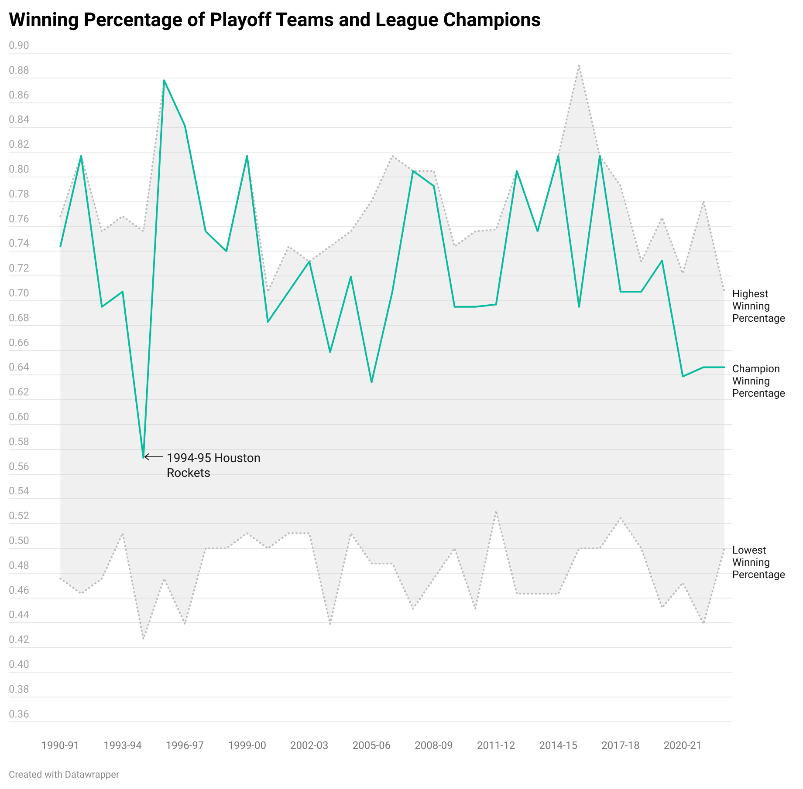
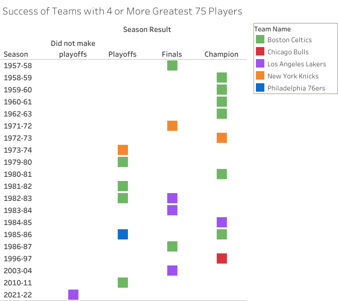
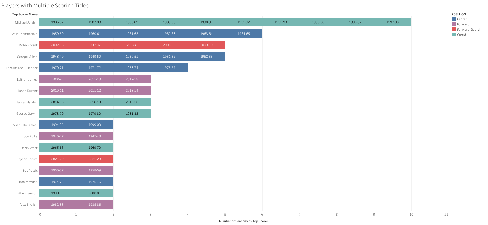
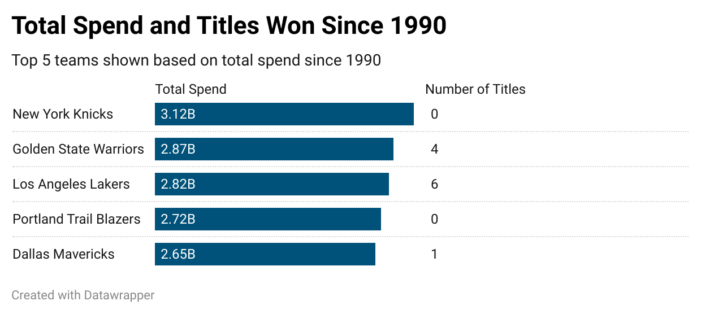

# [dbt™ Data Modeling Challenge - NBA Edition](https://www.paradime.io/dbt-data-modeling-challenge-nba-edition#)
Submission by Katie Shaffer

## Table of Contents
1. [Introduction](#introduction)
2. [Data Sources](#data-sources)
3. [Methodology](#methodology)
   - [Tools Used](#tools-used)
   - [Applied Techniques](#applied-techniques)
4. [Visualizations](#visualizations)
   - [Playoff Team Winning Percentages Over Time](#playoff-win-pct)
   - [Largest Improvement in a Single Season](#largest-turnaround)
   - [Teams with Most Legendary Players](#legendary-teams)
   - [Players with Multiple Scoring Titles](#scoring-titles)
   - [Total Spend and Titles Won Since 1990](#knicks-are-bad)
5. [Conclusions](#conclusions)

## Introduction
Explore my project for the _dbt™ data modeling challenge - NBA Edition_, Hosted by [Paradime](https://www.paradime.io/)! This project dives into the analysis and visualization of NBA statistics, designed for basketball enthusiasts and analysts.

### [My GitHub repo](https://github.com/paradime-io/paradime-dbt-nba-data-challenge/tree/nba-katie-shaffer-wellthy-com)

## Data Sources
My analysis leverages 5 key NBA datasets from Paradime:
- *COMMON_PLAYER_INFO*
- *PLAYER_GAME_LOGS*
- *PLAYER_SALARIES_BY_SEASON*
- *TEAM_SPEND_BY_SEASON*
- *TEAM_STATS_BY_SEASON*

## Methodology
### Tools Used
- **[Paradime](https://www.paradime.io/)** for SQL, dbt™.
- **[Snowflake](https://www.snowflake.com/)** for data storage and computing.
- **Tableau Public** and **Datawrapper** for data visualization.

### Applied Techniques
- SQL and dbt™ to transform _stg_common_player_info_ into player_demographics
- SQL and dbt™ to transform _stg_player_game_logs_ and _stg_player_salaries_by_season_ to create a combined table of player game stats and salary information by season 
- SQL and dbt™ to transform _stg_team_stats_by_season_ and _stg_team_spend_by_season_ to create a combined table of team stats and salary information by season 
- SQL and dbt™ to create aggregated model of team ranks by season on key game and salary metrics
- SQL and dbt™ to create aggregated model of overall stats by season across all teams for comparison of trends over time (such as whether more three point shots are attempted in recent seasons compared to past seasons)

## Visualizations

### Playoff Team Winning Percentages Over Time
Visualization of the minimum and maximum regular season winning percentage for playoff teams, as well as the winning percentage of the team that won the league title

*Insights:*
Since 1990, the 1994-95 Houston Rockets were the team with the lowest winning percentage (.570) to win the championship
There were only 7 seasons in this timeframe (out of 33) where the playoff cutoff was above .500
There were 12 seasons where the team with the highest regular season winning percentage won the championship (including every season between 95-96 and 99-00)

### Largest Improvement in a Single Season
A look at the biggest single season turnarounds in NBA history, by comparing a team's season record to the prior season

*Insights:* 
The 2007-08 Celtics had the biggest turnaround in NBA history. They won 26 games in 2006-07 and 66 the following season, including the league championship.
The 1999-00 Los Angeles Lakers pulled off a similar feat to win the league championship, improving by 36 wins over the prior season.

### Teams with Most Legendary Players
Shows which teams had the most members of the [NBA Greatest 75 Team](https://www.nba.com/news/nba-75th-anniversary-team-announced) playing for them at one time and how they performed.

*Insights:* 
There is little variety in the teams that had the most legendary players, with only 5 distinct teams ever having 4 or more legendary players. 
The Celtics had the most seasons with 4+ legendary players by far, including 6 championship seasons.
The 2021-22 LA Lakers were the worst performing of these teams, as the only one that did not make the playoffs.

### Players with Multiple Scoring Titles
Highlights players who have been the top scorer in the NBA for at least 2 seasons.

*Insights:* 
Michael Jordan has the most scoring titles with 10. This includes 7 seasons in a row between 1986-97 and 1992-93. He is the only guard to capture more than 3 scoring titles.
Wilt Chamberlain won the second most titles, winning in 6 consecutive seasons.

### Total Spend and Titles Won Since 1990
Shows the top 5 teams in terms of total spend since 1990, as well as the number of championships won in that timeframe

*Insights:* 
The Knicks have spent the most money since 1990 combined, but have won zero titles in that time. (Likely not a surprise to any NBA fans.)
The Trail Blazers have spent 2.7 billion in this timeframe and have also won zero titles (though they seem to get less flack for it than the Knicks).

## Conclusions
This project successfully extracts significant insights from NBA data, such as: 

- The team with the highest regular season winning percentage doesn't typically win the league championship
- Top players in their prime like Michael Jordan and Wilt Chamberlain dominated the league for several seasons in a row in terms of scoring
- Dynasty teams like the Celtics and Lakers often had the most members of the NBA Greatest 75 Team
- Spending the most money does not guarantee you a championship
- ...but keep the hope Knicks fans. If you are a bad team, there is always a chance for a miraculous single sesaon turnaround that can take you straight to the top