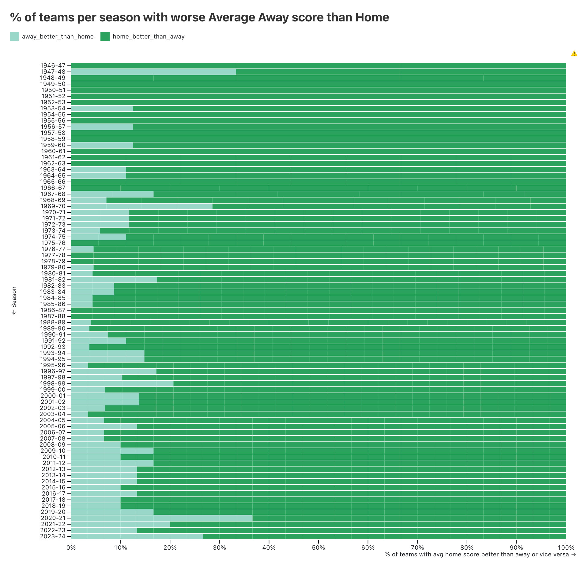
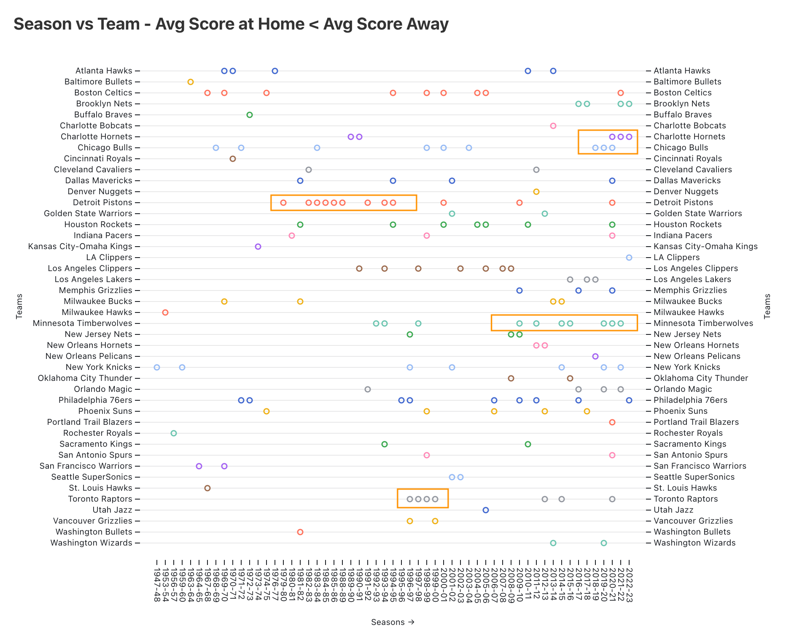
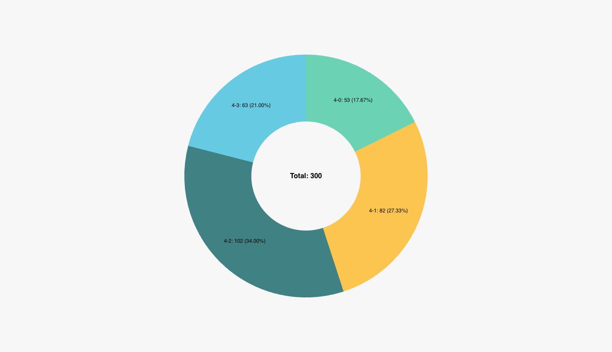
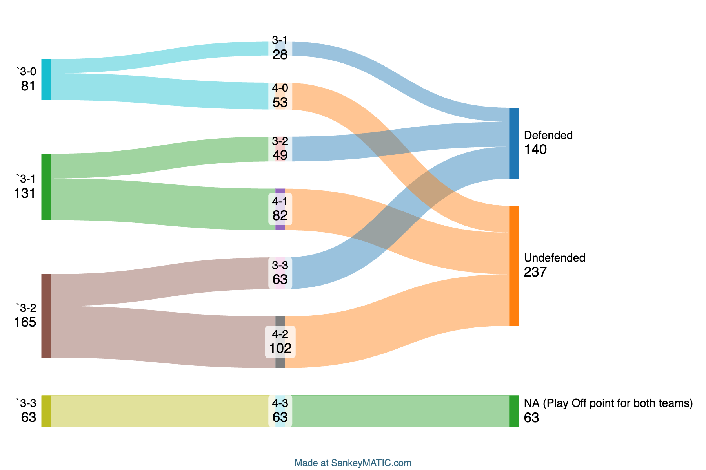
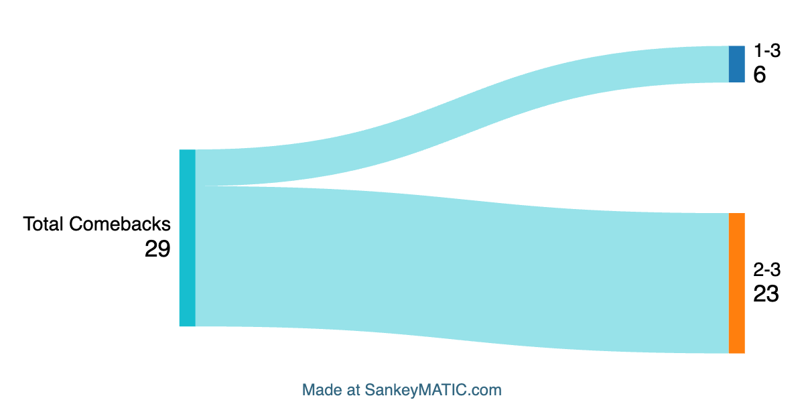

# [dbt™ Data Modeling Challenge - NBA Edition](https://www.paradime.io/dbt-data-modeling-challenge-nba-edition#)

Submission made by [Gautam Doulani](https://www.linkedin.com/in/gautam-doulani-254647b8/)  
Repository: [paradime-dbt-nba-data-challenge](https://github.com/paradime-io/paradime-dbt-nba-data-challenge/tree/nba_gautam_doulani)  
Branch: `nba_gautam_doulani`

## Table of Contents
1. [Introduction](#introduction)
2. [Data Sources](#data-sources)
3. [Methodology](#methodology)
   - [Tools Used](#tools-used)
   - [Applied Techniques](#applied-techniques)
4. [Visualizations](#visualizations)
   - [Team Playoff Appearances](#team-playoff-appearances)
   - [Player Playoff Games](#player-playoff-games)
   - [Top Playoff Scorers](#top-playoff-scorers)
   - [Top Regular Season Scorers](#top-regular-season-scorers)
   - [NBA Players by University](#nba-players-by-university)
5. [Conclusions](#conclusions)

## Introduction
Explore my project for the _dbt™ data modeling challenge - NBA Edition_, Hosted by [Paradime](https://www.paradime.io/)! This project dives into the analysis and visualization of NBA statistics, designed for basketball enthusiasts and analysts.

## Data Sources
My analysis leverages three key NBA datasets from Paradime:
- *GAMES*
- *TEAM_STATS_BY_SEASON*
- *COMMON_PLAYER_INFO*

## Methodology
### Tools Used
- **[Paradime](https://www.paradime.io/)** for SQL, dbt™.
- **[Snowflake](https://www.snowflake.com/)** for data storage and computing.
- **[Observable](https://observablehq.com/)** , **[SankeyMatic](https://sankeymatic.com/build/)** and **[Superset](https://github.com/apache/superset)** for data visualization.

### Applied Techniques
- SQL and dbt™ to transform _stg_player_game_logs_ and _stg_common_player_info_ into seasonal player statistics broken down by age and average time played by the age group.
- SQL and dbt™ to transform _stg_games_ to segregate the home games away from away and the use dbt™ utils Pivot functionality to calculate average score by each team at home vs away per season.
- SQL and dbt™ to transform _stg_games_ to rank each match of each playoff and then use Window functions like LAG to view the outcome of next match in a playoff.

## Visualizations
### % Time played by Age group

Visualisation of % total time played per season by a each age group. The size and intensity of colour of the bubble signify the contribution.

Link to viz - [Observable](https://observablehq.com/d/0530995b86e91cff)

_Insights_: Since the year 2000 players of age 19, 20 and 21 started getting more time on the court. The time spent by this age group has been increasing every year since then.

### Average Away points > Home points per season

Visualisation show portion of teams per season who have had an average score at away games greater than their average score at home.

Link to viz - [Observable](https://observablehq.com/d/f65ba037d61292ef)

Let's dial lower into only the teams who have had an average score at away games greater than their average score at home. The anomalies have been hilighted with rectangular boxes. 
Each dot represents season when this occured.

Link to viz - [Observable](https://observablehq.com/d/44e662d518ab9310)

_Insights_: It is very rare for teams to have an Average Away score > Home score but in the recent years we have seen teams do this 3 seasons in a row. And some teams have faced this a lot more than others.

### Play Off End Score Analysis

__Note__: All the Playoff analysis has been done for `20 years between 2003 and 2022.`

We all know that Playoffs have 7 matches each so there are 4 possibilites in how a playoff can end - `4-0, 4-1, 4-2 and 4-3`. This visualisaton shows the distribution of how the playoffs have ended in the past.

_Insights_: Statistically the districution should be ~25% each but in real like the end score of 4-2 seems to be the most common one with 34%.

In Tennis there is a concept of set, match or championship point which is to say if the player wins the point then they win the set, match or championship respectively. 
Applying the same logic to Play Offs, the graph shows how many such situations were created i.e. a team was at 3 matches and the next match win would have won them the playoff and the what happened in the next match.

_Insights_: It is very rare for a team to come back from Playoff point. Even if a team is trailing 3-2, only around 38% of the times does a team take it to 3-3.

Visualisation shows the number of times a team came back from a 3-1 or 3-2 deficit to win the over all play off. 

_Note_: The 3-2 comebacks do not include the 3-1 comebacks

_Insights_: These numbers are very low 4% and 13% of total such situations for 1-3 and 2-3 deficit cases respectively.

### Conclusions
1. NBA is getting younger
2. Charlotte Hornets, Chicago Bulls and Minnesota Timberwolves have each had 3 consecutive avg away score > avg home score in the last 4 season.
3. It's extremely rare for teams to come back once the other team has won 3 points specially when a team has is 1-3 down. Denver Nuggets did this twice in the year 2020.