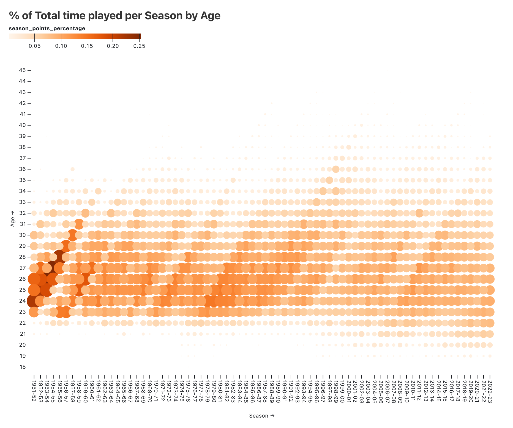

# [dbt™ Data Modeling Challenge - NBA Edition](https://www.paradime.io/dbt-data-modeling-challenge-nba-edition#)

Submission made by [Gautam Doulani](https://www.linkedin.com/in/gautam-doulani-254647b8/)  
Repository: [paradime-dbt-nba-data-challenge](https://github.com/paradime-io/paradime-dbt-nba-data-challenge/tree/nba_gautam_doulani)  
Branch: `nba_gautam_doulani`

## Table of Contents
1. [Introduction](#introduction)
2. [Data Sources](#data-sources)
3. [Methodology](#methodology)
   - [Tools Used](#tools-used)
   - [Applied Techniques](#applied-techniques)
4. [Visualizations](#visualizations)
   - [Team Playoff Appearances](#team-playoff-appearances)
   - [Player Playoff Games](#player-playoff-games)
   - [Top Playoff Scorers](#top-playoff-scorers)
   - [Top Regular Season Scorers](#top-regular-season-scorers)
   - [NBA Players by University](#nba-players-by-university)
5. [Conclusions](#conclusions)

## Introduction
Explore my project for the _dbt™ data modeling challenge - NBA Edition_, Hosted by [Paradime](https://www.paradime.io/)! This project dives into the analysis and visualization of NBA statistics, designed for basketball enthusiasts and analysts.

## Data Sources
My analysis leverages three key NBA datasets from Paradime:
- *GAMES*
- *TEAM_STATS_BY_SEASON*
- *COMMON_PLAYER_INFO*

## Methodology
### Tools Used
- **[Paradime](https://www.paradime.io/)** for SQL, dbt™.
- **[Snowflake](https://www.snowflake.com/)** for data storage and computing.
- **[Observable](https://observablehq.com/)** , **[SankeyMatic](https://sankeymatic.com/build/)** and **[Superset](https://github.com/apache/superset)** for data visualization.

### Applied Techniques
- SQL and dbt™ to transform _stg_player_game_logs_ and _stg_common_player_info_ into seasonal player statistics broken down by age and average minutes played.

## Visualizations
### % of Total Minutes played per Season by an Age group
Visualization of playoff appearances for all 30 NBA teams, including their playoff appearance rates.

